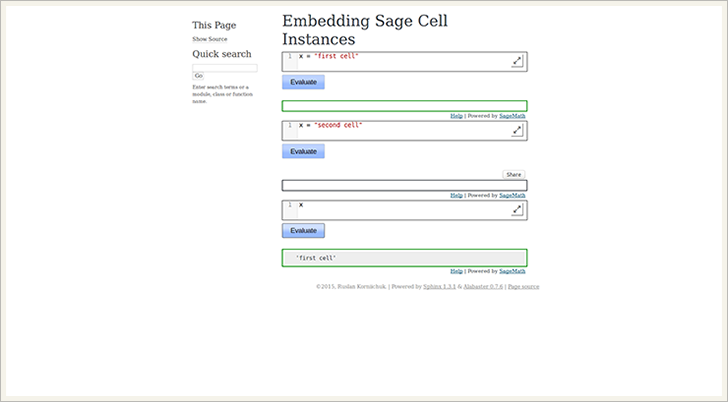

.. contents:: Table of contents
   :depth: 3

Installation
============
Install the sphinx-sagecell-ext from PyPI
-----------------------------------------
::

    $ sudo pip install sphinx-sagecell-ext

Install the sphinx-sagecell-ext from GitHub
-------------------------------------------
::

    $ sudo pip install git+git://github.com/korniichuk/sphinx-sagecell-ext#egg=sphinx-sagecell-ext

Upgrade the sphinx-sagecell-ext from PyPI
-----------------------------------------
::

    $ sudo pip install -U sphinx-sagecell-ext

or::

    $ sudo pip install --upgrade sphinx-sagecell-ext

Uninstall the sphinx-sagecell-ext
---------------------------------
::

    $ sudo pip uninstall sphinx-sagecell-ext

Development installation
========================
::

    $ git clone git://github.com/korniichuk/sphinx-sagecell-ext.git
    $ cd sphinx-sagecell-ext
    $ sudo pip install .

Quickstart
==========
**First**, copy ``layout.html`` file to ``_templates`` documentation directory::

    $ wget -P DEST https://raw.githubusercontent.com/korniichuk/sphinx-sagecell-ext/master/layout.html

Where:

* ``DEST`` -- a path to ``_templates`` documentation directory.

Example::

    $ wget -P ~/sphinx-sagecell-ext/source/_templates https://raw.githubusercontent.com/korniichuk/sphinx-sagecell-ext/master/layout.html

**Second**, add ``sphinx-sagecell-ext.sagecell`` extension to ``conf.py`` documentation file:::

    extensions = [
        'sphinx-sagecell-ext.sagecell'
    ]

Usage
=====
The following is some example usage::

    .. sagecell::

       sphere()

Options
=======
The key/value pairs serve as the configuration of the created Sage Cell instance. The following options can be set when embedding:

Linked cells
------------
When multiple input locations are given, this sets whether the code from these cells is to be executed from the same kernel, so that code executed in one will affect the execution of code from another cell::

    .. sagecell::
       :linked: true

    .. sagecell::
       :linked: false

.. note:: This option is false by default.

For changing the default value. First, open the ``/usr/local/lib/python2.7/dist-packages/sphinx-sagecell-ext/sagecell.py`` file::

    $ sudo gedit /usr/local/lib/python2.7/dist-packages/sphinx-sagecell-ext/sagecell.py

Second, change the next code from::

    linked = False

to::

    linked = True

Example
^^^^^^^
::

    .. sagecell::
       :linked: true

       x = "first cell"

    .. sagecell::
       :linked: false

       x = "second cell"

    .. sagecell::
       :linked: true

       x

